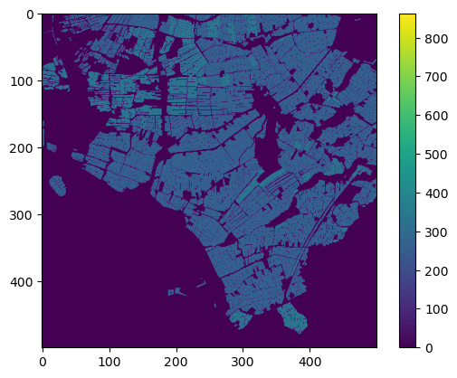
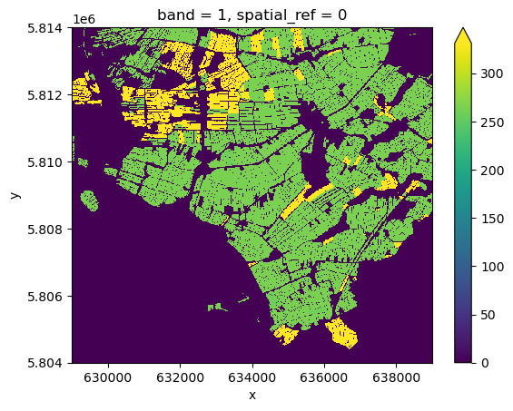

# Introduction

Statistics on predefined zones of the raster data are commonly used for analysis and to better understand the data. These zones are often provided within a single vector dataset, identified by certain vector attributes. For example, in the previous episodes, we used the crop field polygon dataset. The fields with the same crop type can be identified as a "zone", resulting in multiple zones in one vector dataset. One may be interested in performing statistical analysis over these crop zones.

In this episode, we will explore how to calculate zonal statistics based on the types of crops in `fields_cropped.shp`. To do this, we will first identify zones from the vector data, then rasterize these vector zones. Finally the zonal statistics for `ndvi` will be calculated over the rasterized zones.


# Making vector and raster data compatible
First, let's load the `NDVI.tif` file saved in the previous episode to obtained our calculated raster `ndvi` data. We also use the `squeeze()` function in order to reduce our raster data `ndvi` dimension to 2D by removing the singular `band` dimension - this is necessary for use with the `rasterize` and `zonal_stats` functions:

~~~
import rioxarray
ndvi = rioxarray.open_rasterio("NDVI.tif").squeeze()
~~~
{: .language-python}

Let's also read the crop fields vector data from our saved `fields_cropped.shp` file.

~~~
import geopandas as gpd
fields = gpd.read_file('fields_cropped.shp')
~~~
{: .language-python}

In order to use the vector data as a classifier for our raster, we need to convert the vector data to the appropriate CRS. We can perform the CRS conversion from the vector CRS (EPSG:28992) to our raster `ndvi` CRS (EPSG:32631) with:
~~~
# Uniform CRS
fields = fields.to_crs(ndvi.rio.crs)
~~~
{: .language-python}

# Rasterizing the vector data

To make the vector data `fields` comparable with the raster `ndvi`, we will rasterize the vector data with the `rasterio.features.rasterize` function. With this function, we aim to produce a grid with numerical values representing the types of crops as defined by the column `gewascode` from `field_cropped` - `gewascode` stands for the crop codes as defined by the Netherlands Enterprise Agency (RVO) for different types of crops or `gewas` (Grassland, permanent; Grassland, temporary; corn fields; etc.). This grid of values thus defines the zones for the `xrspatial.zonal_stats` function, where each pixel in the zone grid overlaps with a corresponding pixel in our NDVI raster.

We can generate the `geometry, gewascode` pairs for each vector feature to be used as the first argument to `rasterio.features.rasterize` as:

~~~
geom = fields[['geometry', 'gewascode']].values.tolist()
geom
~~~
{: .language-python}

~~~
[[<shapely.geometry.polygon.Polygon at 0x7ff88666f670>, 265],
 [<shapely.geometry.polygon.Polygon at 0x7ff86bf39280>, 265],
 [<shapely.geometry.polygon.Polygon at 0x7ff86ba1db80>, 265],
 [<shapely.geometry.polygon.Polygon at 0x7ff86ba1d730>, 265],
 [<shapely.geometry.polygon.Polygon at 0x7ff86ba1d400>, 265],
 [<shapely.geometry.polygon.Polygon at 0x7ff86ba1d130>, 265],
...
 [<shapely.geometry.polygon.Polygon at 0x7ff88685c970>, 265],
 [<shapely.geometry.polygon.Polygon at 0x7ff88685c9a0>, 265],
 [<shapely.geometry.polygon.Polygon at 0x7ff88685c9d0>, 265],
 [<shapely.geometry.polygon.Polygon at 0x7ff88685ca00>, 331],
 ...]
~~~
{: .output}

This generates a list of the shapely geometries from the `geometry` column, and the unique field ID from the `gewascode` column in the `fields` geodataframe.

We can now rasterize our vector data using `rasterio.features.rasterize`:

~~~
from rasterio import features
fields_rasterized = features.rasterize(geom, out_shape=ndvi.shape, transform=ndvi.rio.transform())
~~~
{: .language-python}

The argument `out_shape` specifies the shape of the output grid in pixel units, while `transform` represents the projection from pixel space to the projected coordinate space. By default, the pixels that are not contained within a polygon in our shapefile will be filled with 0. It's important to pick a fill value that is not the same as any value already defined in `gewascode` or else we won't distinguish between this zone and the background.

Let's inspect the results of rasterization:

~~~
import numpy as np
print(fields_rasterized.shape)
print(np.unique(fields_rasterized))
~~~
{: .language-python}

~~~
(500, 500)
[  0 259 265 266 331 332 335 863]
~~~
{: .output}

The output `fields_rasterized` is an `np.ndarray` with the same shape as `ndvi`. It contains `gewascode` values at the location of fields, and 0 outside the fields. Let's visualize it:

~~~
from matplotlib import pyplot as plt
plt.imshow(fields_rasterized)
plt.colorbar()
~~~
{: .language-python}



We will convert the output to `xarray.DataArray` which will be used further. To do this, we will "borrow" the coordinates from `ndvi`, and fill in the rasterization datat:
~~~
import xarray as xr
fields_rasterized_xarr = ndvi.copy()
fields_rasterized_xarr.data = fields_rasterized

# visualize
fields_rasterized_xarr.plot(robust=True)
~~~
{: .language-python}



# Calculate zonal statistics

In order to calculate the statistics for each crop zone, we call the function, `xrspatial.zonal_stats`. The `xrspatial.zonal_stats` function takes as input `zones`, a 2D `xarray.DataArray`, that defines different zones, and `values`, a 2D `xarray.DataArray` providing input values for calculating statistics.

We call the `zonal_stats` function with `fields_rasterized_xarr` as our classifier and the 2D raster with our values of interest `ndvi` to obtain the NDVI statistics for each crop type:

~~~
from xrspatial import zonal_stats
zonal_stats(fields_rasterized_xarr, ndvi)
~~~
{: .language-python}

~~~
	zone	mean	max	min	sum	std	var	count
0	0	0.266531	0.999579	-0.998648	38887.648438	0.409970	0.168075	145903.0
1	259	0.520282	0.885242	0.289196	449.003052	0.111205	0.012366	863.0
2	265	0.775609	0.925955	0.060755	66478.976562	0.091089	0.008297	85712.0
3	266	0.794128	0.918048	0.544686	1037.925781	0.074009	0.005477	1307.0
4	331	0.703056	0.905304	0.142226	10725.819336	0.102255	0.010456	15256.0
5	332	0.681699	0.849158	0.178113	321.080261	0.123633	0.015285	471.0
6	335	0.648063	0.865804	0.239661	313.662598	0.146582	0.021486	484.0
7	863	0.388575	0.510572	0.185987	1.165724	0.144245	0.020807	3.0
~~~
{: .output}

The `zonal_stats` function calculates the minimum, maximum, and sum for each zone along with statistical measures such as the mean, variance and standard deviation for each rasterized vector zone. In our raster dataset `zone = 0`, corresponding to non-crop areas, has the highest count followed by `zone = 265` which corresponds to 'Grasland, blijvend' or 'Grassland, permanent'. The highest mean NDVI is observed for `zone = 266` for 'Grasslands, temporary' with the lowest mean, aside from non-crop area, going to `zone = 863` representing 'Forest without replanting obligation'. Thus, the `zonal_stats` function can be used to analyze and understand different sections of our raster data. The definition of the zones can be derived from vector data or from classified raster data as presented in the challenge below:

> ## Challenge: Calculate zonal statistics for zones defined by `ndvi_classified`
>
> Let's calculate NDVI zonal statistics for the different zones as classified by `ndvi_classified` in the previous episode.
>
> Load both raster datasets: `NDVI.tif` and `NDVI_classified.tif`. Then, calculate zonal statistics for each `class_bins`. Inspect the output of the `zonal_stats` function.
>
>
> > ## Answers
> > 1) Load and convert raster data into suitable inputs for `zonal_stats`:
> >
> > ```python
> > ndvi = rioxarray.open_rasterio("NDVI.tif").squeeze()
> > ndvi_classified = rioxarray.open_rasterio("NDVI_classified.tif").squeeze()
> > ```
> >
> > 2) Create and display the zonal statistics table.
> >
> > ```python
> > zonal_stats(ndvi_classified, ndvi)
> > ```
> > 
> > ~~~
> > 	zone    mean       max        min           sum         std      var	  count  
> > 0     1  -0.355660  -0.000257  -0.998648  -12838.253906  0.145916  0.021291  36097.0  
> > 1     2   0.110731   0.199839   0.000000    1754.752441  0.055864  0.003121  15847.0  
> > 2     3   0.507998   0.700000   0.200000   50410.167969  0.140193  0.019654  99233.0  
> > 3     4   0.798281   0.999579   0.700025   78888.523438  0.051730  0.002676  98823.0
> > ~~~
> > {: .output}
> {: .solution}
{: .challenge}



